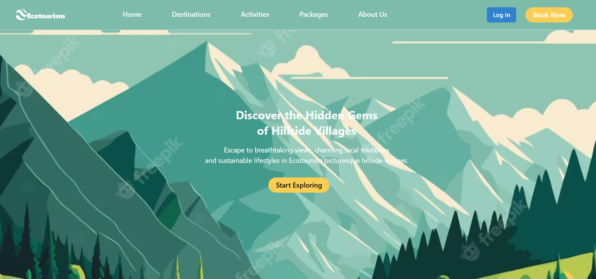
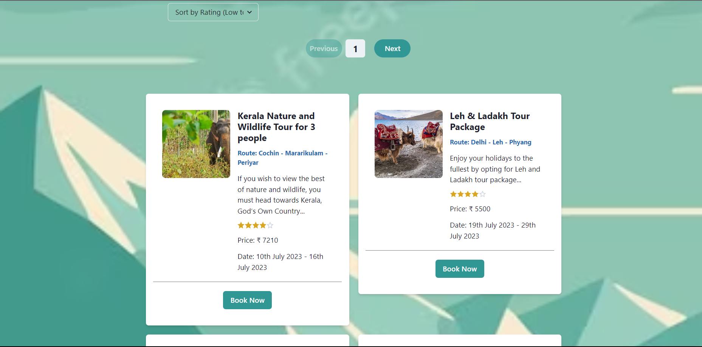
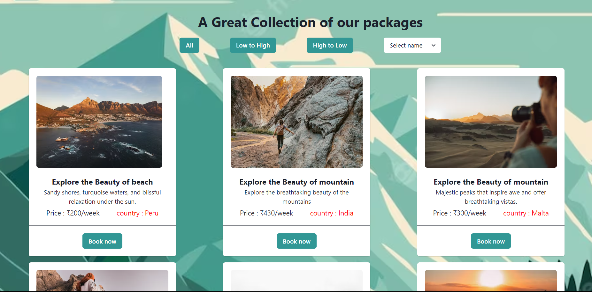

# Ecotourism Website

Ecotourism Website provides ecotourist destinations and packages with affordable price range across world and in india.


## Deployment

Website is hosted on Vercel

```bash
  eco-tourism-frontend.vercel.app/
```


## Features

- Users can sort & filter the vacations based on different parameters
- UI with Chakra UI components.
- Integration with MongoDB for data storage.
- Hosted on Vercel for easy access.

## Tech Stack

- Frontend: React, Chakra UI
- Hosting: Vercel

## Installation

1. Clone the repository:
git clone https://github.com/Sumanthrr26/EcoTourism-frontend


2. Navigate to the project directory:


3. Install dependencies for frontend :
cd client
npm install


4. Start the development server:
cd ../client
npm start


## Screenshots

Here are some screenshots of the Flipkart clone website:








## Contact

Feel free to contact me at sumanthr26@gmail.com for any questions or inquiries.
